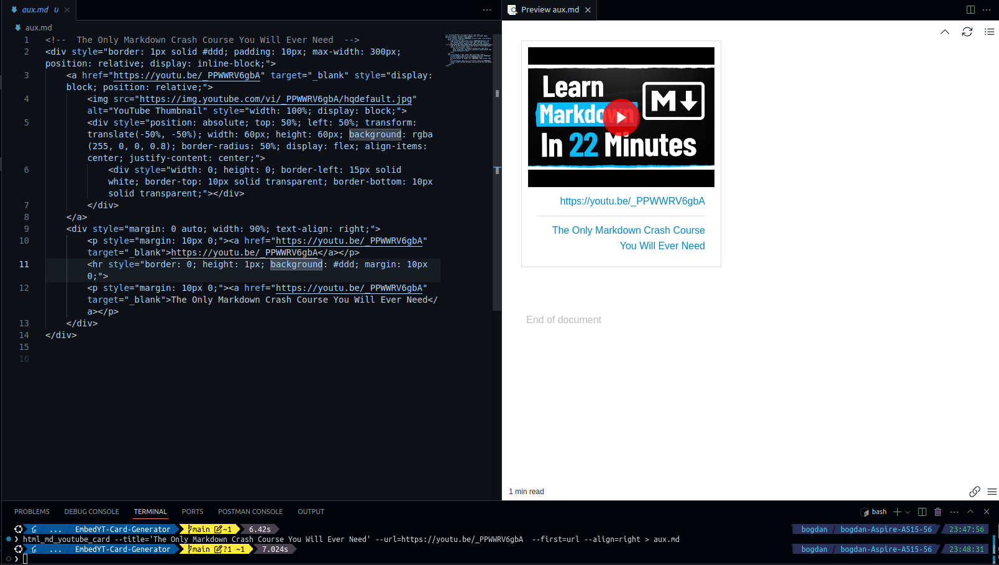
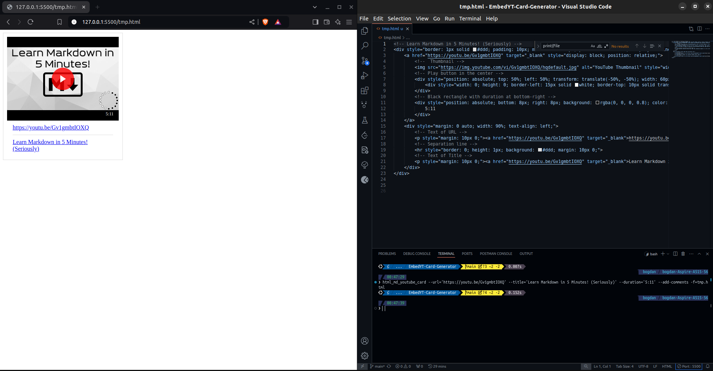

# Embed YouTube Card Generator

🚀 Glow up your HTML/Markdown files with this simple Python script!
Just provide a YouTube URL as input, and it generates a sleek, clickable YouTube card for you.
Perfect for embedding videos in your blog, documentation, or personal projects.

This card comes with:

- 📺 An automatically generated thumbnail from the YouTube video.
- ▶️ A bold play button right in the center.
- 🔗 A clickable link to the video (both on the image and as text below).


# Preview/Results





Also see [Samples/test.pdf](Samples/test.pdf).


# Why use it?


If you want to make your HTML/Markdown files stand out and look clean,
this is exactly what you need!

No need to wrestle with complex embeds—this card is lightweight, visually appealing, and super easy to implement.


# What do you get?

Clean, ready-to-use HTML that you can drop anywhere:

```html
<div style="border: 1px solid #ddd; padding: 10px; max-width: 300px; position: relative; display: inline-block;">
  <a href="https://youtu.be/WRsKs-K6iII" target="_blank" style="display: block; position: relative;">
    
    <div style="position: absolute; top: 50%; left: 50%; transform: translate(-50%, -50%); width: 60px; height: 60px; background: rgba(255, 0, 0, 0.8); border-radius: 50%; display: flex; align-items: center; justify-content: center;">
      <div style="width: 0; height: 0; border-left: 15px solid white; border-top: 10px solid transparent; border-bottom: 10px solid transparent;"></div>
    </div>
  </a>
  <div style="margin: 0 auto; width: 90%; text-align: center;">
    <p style="margin: 10px 0;"><a href="https://youtu.be/WRsKs-K6iII" target="_blank">https://youtu.be/WRsKs-K6iII</a></p>
  </div>
</div>
```


# My Personal Motivation

✨ **I set out to bring boring, lifeless links in Markdown to life!** ✨

We've all seen those plain YouTube links in `.md` files that do nothing to grab attention.
My goal was to create a more engaging and visually appealing way to embed YouTube videos in Markdown files. With this script, those bland URLs transform into clickable, attractive YouTube cards that stand out.

When working with Markdown files, the results really shine when viewed with tools like:

- 🖼️ `Markdown Preview` - great for local previews while you're editing.
- 📄 `Markdown PDF` `+` `PDF Viewer` - perfect for exporting your Markdown into a professional-looking PDF.

> Note: On `GitHub`, the cards won't render as beautifully
> due to `GitHub`'s restrictions on custom HTML rendering.
> But locally and in PDFs, they look amazing, they will **shine**! 🌟


# Description

This Python scripts aims to generate HTML/MarkDown code
for a **clickable YouTube card**, that can be customized.

It will take a `URL` as input, representing the link to the YouTube Video/Short.
This `URL` will be matched against the following `REGEX`:
- `^https://youtu.be/[A-Za-z0-9-_]{11}[\/\?]?$'`
- `^https://youtu.be/[A-Za-z0-9-_]{11}\?t=[0-9]+[\/\?]?$'`
- `^https://youtu.be/watch\?v=[A-Za-z0-9-_]{11}[\/\?]?$'`
- `^https://youtu.be/watch\?v=[A-Za-z0-9-_]{11}\?t=[0-9]+[\/\?]?$'`
- `^https://youtu.be/[A-Za-z0-9-_]{11}\?list=[A-Za-z0-9-_]{34}[\/\?]?$'`
- `^https://youtu.be/[A-Za-z0-9-_]{11}\?list=[A-Za-z0-9-_]{34}&t=[0-9]+[\/\?]?$'`
- `^https://www.youtube.com/watch\?v=[A-Za-z0-9-_]{11}[\?\&]list=[A-Za-z0-9-_]{34}[\/\?]?$'`
- `^https://www.youtube.com/shorts/[A-Za-z0-9-_]{11}[\/\?]?$'`
- `^https://www.youtube.com/shorts/[A-Za-z0-9-_]{11}\?feature=share[\/\?]?$'`
- `^https://www.youtube.com/shorts/[A-Za-z0-9-_]{11}\?t=[0-10]+[\/\?]?$'`
- `^https://www.youtube.com/shorts/[A-Za-z0-9-_]{11}\?t=[0-10]+&feature=share[\/\?]?$'`
- `re.compile('^(?:https?://)?(?:www\\.)?(?:youtube\\.com/(?:[^/]+/.*/|(?:v|e(?:mbed)?|watch|shorts)/|.*[?&]v=)|youtu\\.be/)([a-zA-Z0-9_-]{11})')'`


> Please see the file [valid-URLs.txt](valid-URLs.txt).


If none of them are matched, the program will exit forcefully.

If one of them matches the $URL,
the HTML code for a clickable YouTube card will be generated.

The clickable card can also contain the title of the YouTube Video/Short.
And the user can choose which one to be displayed first, the URL or the TITLE.
The user can also choose the text alingment.


Also, if there is internet connection, the script will check the online resources.


# Dependencies

This tool uses `python3` and is aimed to run on a `UNIX`/`Linux` distro.

The script also uses the `re` module for REGEX and `request` for checking online resources,
so make sure you have it installed.


# Installation

Please see [install.sh](install.sh).


Run the following command in the `Linux` terminal:
```bash
$ chmod +x Src/html_md_youtube_card.py
$ sudo cp Src/html_md_youtube_card.py /usr/local/bin/html_md_youtube_card
```


# Uninstall

You can use the script [uninstall.sh](uninstall.sh).


```bash
$ sudo rm -i /usr/local/bin/html_md_youtube_card
```


# How to use it?


```bash
# Show help output
$ html_md_youtube_card -h

# Show REGEXs used for validating input URL
$ html_md_youtube_card -r

$ html_md_youtube_card -i


$ html_md_youtube_card $URL
$ html_md_youtube_card --url=$URL

# Doesn't matter the order of the options
$ html_md_youtube_card --url=$URL
$ html_md_youtube_card --url=$URL --align=[left|center|right]
$ html_md_youtube_card --url=$URL --title=$TITLE
$ html_md_youtube_card --url=$URL --title=$TITLE --align=[left|center|right]
$ html_md_youtube_card --url=$URL --title=$TITLE --first=[url|title]
$ html_md_youtube_card --url=$URL --title=$TITLE --first=[url|title] --align=[left|center|right]
```


If you want to make sure that the `URL`s are real
and they exist online, use the `-e`/`--exists-online` **option**.

> NOTE: The **flag** `-e`/`--exists-online` should be the first one passed to the script.


```bash
# Checking URLs online
$ html_md_youtube_card -e $URL
$ html_md_youtube_card -e --url=$URL

# Except '-e'/'--exists-online', it doesn't matter the order of the options
$ html_md_youtube_card -e --url=$URL
$ html_md_youtube_card -e --url=$URL --align=[left|center|right]
$ html_md_youtube_card -e --url=$URL --title=$TITLE
$ html_md_youtube_card -e --url=$URL --title=$TITLE --align=[left|center|right]
$ html_md_youtube_card -e --url=$URL --title=$TITLE --first=[url|title]
$ html_md_youtube_card -e --url=$URL --title=$TITLE --first=[url|title] --align=[left|center|right]
```


```bash
# Checking URLs online
$ html_md_youtube_card -e $URL
$ html_md_youtube_card -e --url=$URL

# Except '-e'/'--exists-online', it doesn't matter the order of the options
$ html_md_youtube_card --exists-online --url=$URL
$ html_md_youtube_card --exists-online --url=$URL --align=[left|center|right]
$ html_md_youtube_card --exists-online --url=$URL --title=$TITLE
$ html_md_youtube_card --exists-online --url=$URL --title=$TITLE --align=[left|center|right]
$ html_md_youtube_card --exists-online --url=$URL --title=$TITLE --first=[url|title]
$ html_md_youtube_card --exists-online --url=$URL --title=$TITLE --first=[url|title] --align=[left|center|right]
```


# Code Examples


```bash
$ html_md_youtube_card https://youtu.be/_PPWWRV6gbA
$ html_md_youtube_card --url=https://youtu.be/_PPWWRV6gbA

# Doesn't matter the order of the options
$ html_md_youtube_card --url=https://youtu.be/_PPWWRV6gbA --align=left
$ html_md_youtube_card --align=right --url=https://youtu.be/_PPWWRV6gbA

$ html_md_youtube_card --url=https://youtu.be/_PPWWRV6gbA --title='The Only Markdown Crash Course You Will Ever Need'
$ html_md_youtube_card --url=https://youtu.be/_PPWWRV6gbA --title='The Only Markdown Crash Course You Will Ever Need' --align=left
$ html_md_youtube_card --url=https://youtu.be/_PPWWRV6gbA --title='The Only Markdown Crash Course You Will Ever Need' --first=title
$ html_md_youtube_card --title='The Only Markdown Crash Course You Will Ever Need' --url=https://youtu.be/_PPWWRV6gbA  --first=url --align=right
```

```bash
# It plays nice with redirection
$ html_md_youtube_card https://youtu.be/zhzhTvaFOiw >> aux.md


$ html_md_youtube_card https://youtu.be/2P7fcVHxA9o
<div style="border: 1px solid #ddd; padding: 10px; max-width: 300px; position: relative; display: inline-block;">
        <a href="https://youtu.be/2P7fcVHxA9o" target="_blank" style="display: block; position: relative;">
                
                <div style="position: absolute; top: 50%; left: 50%; transform: translate(-50%, -50%); width: 60px; height: 60px; background: rgba(255, 0, 0, 0.8); border-radius: 50%; display: flex; align-items: center; justify-content: center;">
                        <div style="width: 0; height: 0; border-left: 15px solid white; border-top: 10px solid transparent; border-bottom: 10px solid transparent;"></div>
                </div>
        </a>
        <p><a href="https://youtu.be/2P7fcVHxA9o" target="_blank">Watch This: https://youtu.be/2P7fcVHxA9o</a></p>
</div>
```


```bash
# Works great with redirection
$ html_md_youtube_card --url=https://youtu.be/7qd5sqazD7k --title='BASH scripting will change your life' --first=url --align=left > aux.md


$ html_md_youtube_card --url=https://youtu.be/I4EWvMFj37g --title='Bash in 100 Seconds' --first=url --align=left
<!--  Bash in 100 Seconds  -->
<div style="border: 1px solid #ddd; padding: 10px; max-width: 300px; position: relative; display: inline-block;">
        <a href="https://youtu.be/I4EWvMFj37g" target="_blank" style="display: block; position: relative;">
                
                <div style="position: absolute; top: 50%; left: 50%; transform: translate(-50%, -50%); width: 60px; height: 60px; background: rgba(255, 0, 0, 0.8); border-radius: 50%; display: flex; align-items: center; justify-content: center;">
                        <div style="width: 0; height: 0; border-left: 15px solid white; border-top: 10px solid transparent; border-bottom: 10px solid transparent;"></div>
                </div>
        </a>
        <div style="margin: 0 auto; width: 90%; text-align: left;">
                <p style="margin: 10px 0;"><a href="https://youtu.be/I4EWvMFj37g" target="_blank">https://youtu.be/I4EWvMFj37g</a></p>
                <hr style="border: 0; height: 1px; background: #ddd; margin: 10px 0;">
                <p style="margin: 10px 0;"><a href="https://youtu.be/I4EWvMFj37g" target="_blank">Bash in 100 Seconds</a></p>
        </div>
</div>
```


```bash
$ html_md_youtube_card -i
URL : https://youtu.be/7qd5sqazD7k
Would you like to include the title in the card? Y/n N
Which text alignment do you prefer?
* left
* center
* right
left
<div style="border: 1px solid #ddd; padding: 10px; max-width: 300px; position: relative; display: inline-block;">
        <a href="https://youtu.be/7qd5sqazD7k" target="_blank" style="display: block; position: relative;">
                
                <div style="position: absolute; top: 50%; left: 50%; transform: translate(-50%, -50%); width: 60px; height: 60px; background: rgba(255, 0, 0, 0.8); border-radius: 50%; display: flex; align-items: center; justify-content: center;">
                        <div style="width: 0; height: 0; border-left: 15px solid white; border-top: 10px solid transparent; border-bottom: 10px solid transparent;"></div>
                </div>
        </a>
        <div style="margin: 0 auto; width: 90%; text-align: left;">
                <p style="margin: 10px 0;"><a href="https://youtu.be/7qd5sqazD7k" target="_blank">https://youtu.be/7qd5sqazD7k</a></p>
        </div>
</div>

```


```bash
$ html_md_youtube_card --interactive
URL : https://youtu.be/7qd5sqazD7k
Would you like to include the title in the card? Y/n y
Title : BASH scripting will change your life
Which to display first? Url or Title?
Type 'url' or 'title': title
Which text alignment do you prefer?
* left
* center
* right
left
<!--  BASH scripting will change your life  -->
<div style="border: 1px solid #ddd; padding: 10px; max-width: 300px; position: relative; display: inline-block;">
        <a href="https://youtu.be/7qd5sqazD7k" target="_blank" style="display: block; position: relative;">
                
                <div style="position: absolute; top: 50%; left: 50%; transform: translate(-50%, -50%); width: 60px; height: 60px; background: rgba(255, 0, 0, 0.8); border-radius: 50%; display: flex; align-items: center; justify-content: center;">
                        <div style="width: 0; height: 0; border-left: 15px solid white; border-top: 10px solid transparent; border-bottom: 10px solid transparent;"></div>
                </div>
        </a>
        <div style="margin: 0 auto; width: 90%; text-align: left;">
                <p style="margin: 10px 0;"><a href="https://youtu.be/7qd5sqazD7k" target="_blank">https://youtu.be/7qd5sqazD7k</a></p>
                <hr style="border: 0; height: 1px; background: #ddd; margin: 10px 0;">
                <p style="margin: 10px 0;"><a href="https://youtu.be/7qd5sqazD7k" target="_blank">BASH scripting will change your life</a></p>
        </div>
</div>

```


