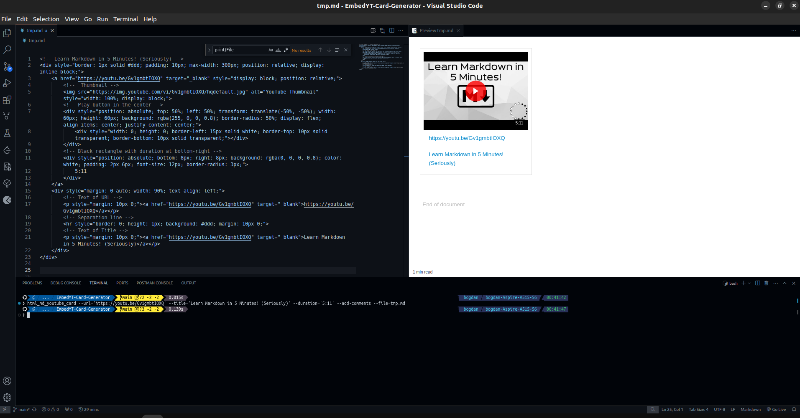

# Customizable Embed YouTube Card Generator

🚀 Glow up your HTML/Markdown files with this simple Python script!
Just provide a YouTube URL as input, and it generates a sleek, clickable YouTube card for you.
Perfect for embedding videos in your blog, documentation, or personal projects.

This card comes with:

- 📺 An automatically generated thumbnail from the YouTube video.
- ▶️ A bold play button right in the center.
- 🔗 A clickable link to the video (both on the image and as text below).


# Preview/Results




Also see [Samples/test.pdf](Samples/test.pdf).


# Why use it?


If you want to make your HTML/Markdown files stand out and look clean,
this is exactly what you need!

No need to wrestle with complex embeds—this card is lightweight, visually appealing, and super easy to implement.


# What do you get?

Clean, ready-to-use HTML that you can drop anywhere:

```html
<div style="border: 1px solid #ddd; padding: 10px; max-width: 300px; position: relative; display: inline-block;">
  <a href="https://youtu.be/WRsKs-K6iII" target="_blank" style="display: block; position: relative;">
    
    <div style="position: absolute; top: 50%; left: 50%; transform: translate(-50%, -50%); width: 60px; height: 60px; background: rgba(255, 0, 0, 0.8); border-radius: 50%; display: flex; align-items: center; justify-content: center;">
      <div style="width: 0; height: 0; border-left: 15px solid white; border-top: 10px solid transparent; border-bottom: 10px solid transparent;"></div>
    </div>
  </a>
  <div style="margin: 0 auto; width: 90%; text-align: center;">
    <p style="margin: 10px 0;"><a href="https://youtu.be/WRsKs-K6iII" target="_blank">https://youtu.be/WRsKs-K6iII</a></p>
  </div>
</div>
```


# My Personal Motivation

✨ **I set out to bring boring, lifeless links in Markdown to life!** ✨

We've all seen those plain YouTube links in `.md` files that do nothing to grab attention.
My goal was to create a more engaging and visually appealing way to embed YouTube videos in Markdown files. With this script, those bland URLs transform into clickable, attractive YouTube cards that stand out.

When working with Markdown files, the results really shine when viewed with tools like:

- 🖼️ [`Markdown Preview Enhanced`](https://marketplace.visualstudio.com/items?itemName=shd101wyy.markdown-preview-enhanced) - great for local previews while you're editing.
- 📄 [`Markdown PDF`](https://marketplace.visualstudio.com/items?itemName=yzane.markdown-pdf) `+` [`PDF Viewer`](https://marketplace.visualstudio.com/items?itemName=tomoki1207.pdf) - perfect for exporting your Markdown into a professional-looking PDF.

> Note: On `GitHub`, the cards won't render as beautifully
> due to `GitHub`'s restrictions on custom HTML rendering.
> But locally and in PDFs, they look amazing, they will **shine**! 🌟


# Description

This Python scripts aims to generate HTML/MarkDown code
for a **clickable YouTube card**, that can be customized.

It will take a `URL` as input, representing the link to the YouTube Video/Short.
This `URL` will be matched against the following `REGEX`:
- `^https://youtu.be/[A-Za-z0-9-_]{11}[\/\?]?$'`
- `^https://youtu.be/[A-Za-z0-9-_]{11}\?t=[0-9]+[\/\?]?$'`
- `^https://youtu.be/watch\?v=[A-Za-z0-9-_]{11}[\/\?]?$'`
- `^https://youtu.be/watch\?v=[A-Za-z0-9-_]{11}\?t=[0-9]+[\/\?]?$'`
- `^https://youtu.be/[A-Za-z0-9-_]{11}\?list=[A-Za-z0-9-_]{34}[\/\?]?$'`
- `^https://youtu.be/[A-Za-z0-9-_]{11}\?list=[A-Za-z0-9-_]{34}&t=[0-9]+[\/\?]?$'`
- `^https://www.youtube.com/watch\?v=[A-Za-z0-9-_]{11}[\?\&]list=[A-Za-z0-9-_]{34}[\/\?]?$'`
- `^https://www.youtube.com/shorts/[A-Za-z0-9-_]{11}[\/\?]?$'`
- `^https://www.youtube.com/shorts/[A-Za-z0-9-_]{11}\?feature=share[\/\?]?$'`
- `^https://www.youtube.com/shorts/[A-Za-z0-9-_]{11}\?t=[0-10]+[\/\?]?$'`
- `^https://www.youtube.com/shorts/[A-Za-z0-9-_]{11}\?t=[0-10]+&feature=share[\/\?]?$'`
- `re.compile('^(?:https?://)?(?:www\\.)?(?:youtube\\.com/(?:[^/]+/.*/|(?:v|e(?:mbed)?|watch|shorts)/|.*[?&]v=)|youtu\\.be/)([a-zA-Z0-9_-]{11})')'`


> Please see the file [valid-URLs.txt](valid-URLs.txt).


If none of them are matched, the program will exit forcefully.

If one of them matches the $URL,
the HTML code for a clickable YouTube card will be generated.

The clickable card can also contain the title of the YouTube Video/Short.
And the user can choose which one to be displayed first, the URL or the TITLE.
The user can also choose the text alingment.


Also, if there is internet connection, the script will check the online resources.


# Dependencies

This tool uses `python3` and is aimed to run on a `UNIX`/`Linux` distro.

The script also uses the `re` module for REGEX and `request` for checking online resources,
so make sure you have it installed.


```bash
$ pip3 install requests  # for HTTP request
$ pip3 install pytube    # getting YouTube clip info
```

> The `typing` and `re` (REGEX) modules
> are already part of Python's standard library.


# Installation

Please see [install.sh](install.sh).


Run the following command in the `Linux` terminal:
```bash
$ chmod +x Src/html_md_youtube_card.py
$ sudo cp Src/html_md_youtube_card.py /usr/local/bin/html_md_youtube_card
```


# Uninstall

You can use the script [uninstall.sh](uninstall.sh).


```bash
$ sudo rm -i /usr/local/bin/html_md_youtube_card
```


# How to use it?


```bash
# Show help output
$ html_md_youtube_card -h

# Show REGEXs used for validating input URL
$ html_md_youtube_card -r

$ html_md_youtube_card -i


$ html_md_youtube_card $URL
$ html_md_youtube_card --url=$URL

# Doesn't matter the order of the options
$ html_md_youtube_card --url=$URL
$ html_md_youtube_card --url=$URL --align=[left|center|right]
$ html_md_youtube_card --url=$URL --title=$TITLE
$ html_md_youtube_card --url=$URL --title=$TITLE --align=[left|center|right]
$ html_md_youtube_card --url=$URL --title=$TITLE --first=[url|title]
$ html_md_youtube_card --url=$URL --title=$TITLE --first=[url|title] --align=[left|center|right]
```


If you want to make sure that the `URL`s are real
and they exist online, use the `-e`/`--exists-online` **option**.

> NOTE: The **flag** `-e`/`--exists-online` MUST BE the first one passed to the script.


```bash
# Checking URLs online
$ html_md_youtube_card -e $URL
$ html_md_youtube_card -e --url=$URL

# Except '-e'/'--exists-online', it doesn't matter the order of the options
$ html_md_youtube_card -e --url=$URL
$ html_md_youtube_card -e --url=$URL --align=[left|center|right]
$ html_md_youtube_card -e --url=$URL --title=$TITLE
$ html_md_youtube_card -e --url=$URL --title=$TITLE --align=[left|center|right]
$ html_md_youtube_card -e --url=$URL --title=$TITLE --first=[url|title]
$ html_md_youtube_card -e --url=$URL --title=$TITLE --first=[url|title] --align=[left|center|right]
```


```bash
# Checking URLs online
$ html_md_youtube_card -e $URL
$ html_md_youtube_card -e --url=$URL

# Except '-e'/'--exists-online', it doesn't matter the order of the options
$ html_md_youtube_card --exists-online --url=$URL
$ html_md_youtube_card --exists-online --url=$URL --align=[left|center|right]
$ html_md_youtube_card --exists-online --url=$URL --title=$TITLE
$ html_md_youtube_card --exists-online --url=$URL --title=$TITLE --align=[left|center|right]
$ html_md_youtube_card --exists-online --url=$URL --title=$TITLE --first=[url|title]
$ html_md_youtube_card --exists-online --url=$URL --title=$TITLE --first=[url|title] --align=[left|center|right]
```


# Valid values for command line options/flags

- `-h`, `--help`
  - Displays a suggestive help message (the manual of the utility).
---

- `-r`, `--rgx`, `--regex`
  - Displays the REGEXs used to validate the input URL and the duration of the videoclip.
---

- `-i`, `--interactive`
  - Takes input in an user-interactive mode in the command line.
  - If the input is invalid, the user will be prompted to try again until a valid response is provided.
  > Doesn't work with `-c`, `--comments`, `--add-comments` option.
---

- `-e`/`--exists-online`
  > MUST BE the first one to be passed ot the script.
  - Verifies if the URLs used for the link and thumbnail exist online.
---


- `-c`, `--comments`, `--add-comments`
  - Add relevant comments in the generaed HTML/MarkDown code
  > NOTE: This flag only works with option (`--url=`/`--title=`/`--align=`/...)!

  > NOTE: This flag DOESN'T work with `-i`/`--interactive`!
  > In **interactive mode**, the user will be specifically asked whether or not to include HTML code comments.

  > NOTE: This flag DOESN'T work when just passing the URL!
---

- `--url=`
  - This option expects a value after the **equal sign**, the URL of the YouTube clip.
  - The URL will be matched against a set of REGEXs to validate if it is an YouTube clip or not.
  - If none of the REGEXs are matched, the program will exit forecefully.
  - If `-e`/`--exists-online` is specified in **CLI**, the URL will be checked online by sending **HTTP request** (if there is internet connection).
---


- `--title=`
  - This option expects the title of the YouTube Video/Short.
---


- `--first=`
  - This option expects a value, either `url` or `title`.
  - Works only when `--title=` is specified in the **CLI**,
  otherwise the program will exit forcefully.
  > NOTE: By default (if the option is not specified), its value is set to `url`.
  >
  > Meaning that the the text of URL will be rendered above the TITLE. 
---


- `--align=`
  - This option expects a value: `left`, `center` or `right`.
  - Control the text alignment of the URL and TITLE texts.
  > NOTE: By default (if the option is not specified), the text alignment is set to `left`. 
---


- `--duration=`
  - This option expects a value, the duration of the YouTube clip.
  - The value will be matched against a set of REGEXs.
  If none of them matches the value, the program will exit forcefully.
---


- `--file=`
  > Writes to a specified file. 
  - This option expects a value, the path to a **writeable file**.
  - Instead of writing the generated HTML/MarkDown code to **stdout**,
  and then **redirecting** or **copying** the text by yourself,
  this flag enables **writing to the end of a specified file**.
  - If the path is not valid, or if an error occurred while writing to the file,
  the program will exit forcefully.
---


- `--auto`
  > MUST BE the first one to be passed ot the script.
  - Simplifies the process of creating the YouTube card
  by automatically fechting clip's information, based on the provided **URL**.
  - It will retrieve from **online**: the thumbnail's URL, the title and the duration.
  - You don't have to specify the values of **TITLE** and **DURATION** anymore.
  - It uses **standardized algorithm** to get this information, using `YouTube` from `pytube` module (`from pytube import YouTube`).
  - The result is more **accurate** when using `--auto` flag.
  - It needs **internet connection**. 
  > You don't need internet connection when you don't use this flag.

  > This flag doesn't work with `--title=`, `--duration=` or `--exists-online`.

  > This flag doesn't work when specifying `--interactive` mode.

  > This flag works only with:
  > - `--url=`
  > - `--first=`
  > - `--align=`
  > - `--file=`
  > - `--add-comments`
---


# Code Examples (Command Line Arguments)


```bash
$ html_md_youtube_card https://youtu.be/_PPWWRV6gbA
$ html_md_youtube_card --url=https://youtu.be/_PPWWRV6gbA

# Doesn't matter the order of the options
$ html_md_youtube_card --url=https://youtu.be/_PPWWRV6gbA --align=left
$ html_md_youtube_card --align=right --url=https://youtu.be/_PPWWRV6gbA

$ html_md_youtube_card --url=https://youtu.be/_PPWWRV6gbA --title='The Only Markdown Crash Course You Will Ever Need'
$ html_md_youtube_card --url=https://youtu.be/_PPWWRV6gbA --title='The Only Markdown Crash Course You Will Ever Need' --align=left
$ html_md_youtube_card --url=https://youtu.be/_PPWWRV6gbA --title='The Only Markdown Crash Course You Will Ever Need' --first=title
$ html_md_youtube_card --title='The Only Markdown Crash Course You Will Ever Need' --url=https://youtu.be/_PPWWRV6gbA  --first=url --align=right
```

```bash
# It plays nice with redirection
$ html_md_youtube_card https://youtu.be/zhzhTvaFOiw >> aux.md


$ html_md_youtube_card https://youtu.be/2P7fcVHxA9o
<div style="border: 1px solid #ddd; padding: 10px; max-width: 300px; position: relative; display: inline-block;">
        <a href="https://youtu.be/2P7fcVHxA9o" target="_blank" style="display: block; position: relative;">
                
                <div style="position: absolute; top: 50%; left: 50%; transform: translate(-50%, -50%); width: 60px; height: 60px; background: rgba(255, 0, 0, 0.8); border-radius: 50%; display: flex; align-items: center; justify-content: center;">
                        <div style="width: 0; height: 0; border-left: 15px solid white; border-top: 10px solid transparent; border-bottom: 10px solid transparent;"></div>
                </div>
        </a>
        <p><a href="https://youtu.be/2P7fcVHxA9o" target="_blank">Watch This: https://youtu.be/2P7fcVHxA9o</a></p>
</div>
```


```bash
# Works great with redirection
$ html_md_youtube_card --url=https://youtu.be/7qd5sqazD7k --title='BASH scripting will change your life' --first=url --align=left > aux.md


$ html_md_youtube_card --url=https://youtu.be/I4EWvMFj37g --title='Bash in 100 Seconds' --first=url --align=left
<!--  Bash in 100 Seconds  -->
<div style="border: 1px solid #ddd; padding: 10px; max-width: 300px; position: relative; display: inline-block;">
        <a href="https://youtu.be/I4EWvMFj37g" target="_blank" style="display: block; position: relative;">
                
                <div style="position: absolute; top: 50%; left: 50%; transform: translate(-50%, -50%); width: 60px; height: 60px; background: rgba(255, 0, 0, 0.8); border-radius: 50%; display: flex; align-items: center; justify-content: center;">
                        <div style="width: 0; height: 0; border-left: 15px solid white; border-top: 10px solid transparent; border-bottom: 10px solid transparent;"></div>
                </div>
        </a>
        <div style="margin: 0 auto; width: 90%; text-align: left;">
                <p style="margin: 10px 0;"><a href="https://youtu.be/I4EWvMFj37g" target="_blank">https://youtu.be/I4EWvMFj37g</a></p>
                <hr style="border: 0; height: 1px; background: #ddd; margin: 10px 0;">
                <p style="margin: 10px 0;"><a href="https://youtu.be/I4EWvMFj37g" target="_blank">Bash in 100 Seconds</a></p>
        </div>
</div>
```


# Code Examples (User Interactive Mode)


```bash
$ html_md_youtube_card -i
URL : https://youtu.be/AE1-W2bMVEs
Would you like to include the title in the card? Y/n y
Title : The Best Gnome Extensions ...
Which to display first? Url or Title?
Type 'url' or 'title': url
Would you like to include the duration of the YouTube Video/Short? Y/n y
Video duration: 9:29
Would you like to include relevant comments in the generated HTML/MD code? Y/n N
Which text alignment do you prefer?
* left
* center
* right
center
Would you write the generated HTML/MD code in a file (redirect)? Y/n y
File path: tmp.md
```


```bash
$ html_md_youtube_card --interactive
URL : https://youtu.be/AE1-W2bMVEs
Would you like to include the title in the card? Y/n n
Would you like to include the duration of the YouTube Video/Short? Y/n N
Would you like to include relevant comments in the generated HTML/MD code? Y/n y
Which text alignment do you prefer?
* left
* center
* right
left
Would you write the generated HTML/MD code in a file (redirect)? Y/n N
<div style="border: 1px solid #ddd; padding: 10px; max-width: 300px; position: relative; display: inline-block;">
        <a href="https://youtu.be/AE1-W2bMVEs" target="_blank" style="display: block; position: relative;">
                <!--  Thumbnail -->
                
                <!-- Play button in the center -->
                <div style="position: absolute; top: 50%; left: 50%; transform: translate(-50%, -50%); width: 60px; height: 60px; background: rgba(255, 0, 0, 0.8); border-radius: 50%; display: flex; align-items: center; justify-content: center;">
                        <div style="width: 0; height: 0; border-left: 15px solid white; border-top: 10px solid transparent; border-bottom: 10px solid transparent;"></div>
                </div>
        </a>
        <div style="margin: 0 auto; width: 90%; text-align: left;">
                <!-- Text of URL -->
                <p style="margin: 10px 0;"><a href="https://youtu.be/AE1-W2bMVEs" target="_blank">https://youtu.be/AE1-W2bMVEs</a></p>
        </div>
</div>


```


```bash
# After in invalid input, the program will not stop,
# But asks the user for a new input, untill it is correct
$ html_md_youtube_card -i
URL : https://youtu.be/AE1-W2bMVEs
Would you like to include the title in the card? Y/n y
Title : The Best Gnome Extensions ...
Which to display first? Url or Title?
Type 'url' or 'title': url
Would you like to include the duration of the YouTube Video/Short? Y/n y
Video duration: 9:92
[ERROR] Invalid input for '--duration' (of the videoclip)!
[ERROR] 9:92 was not validated by any REGEX!
Video duration: 9:29
Would you like to include relevant comments in the generated HTML/MD code? Y/n y
Which text alignment do you prefer?
* left
* center
* right
left
Would you write the generated HTML/MD code in a file (redirect)? Y/n y
File path: tmp.md
```


```bash
# After in invalid input, the program will not stop,
# But asks the user for a new input, untill it is correct
$ html_md_youtube_card --interactive
URL : https://youtu.be/AE1-W2bMVEs
Would you like to include the title in the card? Y/n N
Would you like to include the duration of the YouTube Video/Short? Y/n N
Would you like to include relevant comments in the generated HTML/MD code? Y/n k
[ERROR] Unrecognized response! Please type 'y' for YES and 'n' for NO: L
[ERROR] Unrecognized response! Please type 'y' for YES and 'n' for NO: n
Which text alignment do you prefer?
* left
* center
* right
l   
[ERROR] Invalid input! Please type one of the above text alignments!
left
Would you write the generated HTML/MD code in a file (redirect)? Y/n n
<div style="border: 1px solid #ddd; padding: 10px; max-width: 300px; position: relative; display: inline-block;">
        <a href="https://youtu.be/AE1-W2bMVEs" target="_blank" style="display: block; position: relative;">
                
                <div style="position: absolute; top: 50%; left: 50%; transform: translate(-50%, -50%); width: 60px; height: 60px; background: rgba(255, 0, 0, 0.8); border-radius: 50%; display: flex; align-items: center; justify-content: center;">
                        <div style="width: 0; height: 0; border-left: 15px solid white; border-top: 10px solid transparent; border-bottom: 10px solid transparent;"></div>
                </div>
        </a>
        <div style="margin: 0 auto; width: 90%; text-align: left;">
                <p style="margin: 10px 0;"><a href="https://youtu.be/AE1-W2bMVEs" target="_blank">https://youtu.be/AE1-W2bMVEs</a></p>
        </div>
</div>
```


